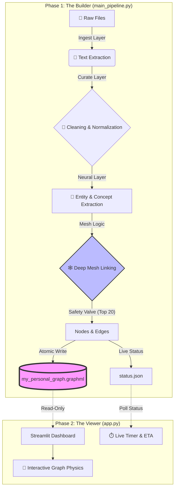

# 🧠 Local Digital Brain

A privacy-first, local Knowledge Graph that transforms raw files into an intelligent "Neural Mesh" using Python, spaCy, and NetworkX. 

> **Status:** v1.0 (Production Stable)
> **Key Tech:** Medallion Architecture, Neural Mesh, Atomic Persistence.

---

## 🏗️ Architecture Flow

This system runs in two decoupled phases: **The Builder** (Backend) and **The Viewer** (Frontend).



---

## 📂 Codebase Structure

The project is organized into two main zones: the **Core Brain Logic** (inside `digital_brain/`) and the **Root Utilities** (helper scripts).

### 🧠 Zone 1: The Digital Brain (`digital_brain/`)

This folder contains the **Medallion Architecture** pipeline. It is the "Engine" of the project.

| File | Layer | Description |
| --- | --- | --- |
| **`layer1_ingest.py`** | 🥉 **Bronze** | **The Raw Reader.** Handles messy binary files. It knows how to open PDFs, extract text from Excel cells, and unzip archives to find code. |
| **`layer2_curate.py`** | 🥈 **Silver** | **The Cleaner.** Removes whitespace, normalizes Unicode, strips HTML tags, and filters out "stop words" (junk data). |
| **`layer3_neural.py`** | 🥇 **Gold** | **The Thinker.** Uses `spaCy` (NLP) to extract named entities (Organizations, Dates, Code Libraries) and identify "Concepts" from the text. |
| **`main_pipeline.py`** | ⚙️ **Orchestrator** | **The Boss.** Runs the loop. It manages the "Safety Valve" (memory limits), handles the Atomic Saves, and updates `status.json` for the frontend. |
| **`config.py`** | 🔧 **Settings** | **The Control Panel.** Defines which file extensions to scan (`.py`, `.md`, `.pbix`) and sets folder paths. |

### 🛠️ Zone 2: Root Utilities

These are standalone scripts that support the main application or provide experimental features.

| File | Purpose |
| --- | --- |
| **`app.py`** | **The Frontend.** A Streamlit application that reads the `.graphml` database and visualizes it using `PyVis`. It includes the Live Timer and Physics Engine. |
| **`Crawler.py`** | **Data Scout.** A standalone script used to spider through directories and list files without processing them (useful for debugging file permissions). |
| **`nlp_processor.py`** | **NLP Lab.** A testing ground for the spaCy model. Used to tweak entity recognition rules before moving them into `layer3_neural.py`. |
| **`render_all.py`** | **Static Renderer.** Generates a static HTML file of the entire graph (without the Streamlit UI) for quick sharing. |
| **`deep_mesh_builder.py`** | **Experimental.** A playground for testing new "Deep Mesh" algorithms before they are merged into the main pipeline. |

---

## ⚙️ How It Works (The "Why")

### 1. The Builder (`main_pipeline.py`)

This is the heavy lifter. It scans your hard drive and builds the brain.

* **Medallion Architecture:**
* **Bronze:** Raw binary reading (PDF, PBIX, XLSX).
* **Silver:** Text curation (removing whitespace, weird characters).
* **Gold:** Knowledge extraction using NLP.


* **The "Safety Valve" (CRITICAL):**
* *Problem:* Connecting every concept to every other concept creates an exponential explosion (), causing RAM crashes on 20k+ files.
* *Solution:* We cap connections to the **Top 20** most relevant concepts per file. This keeps the "Intelligence" high but the RAM usage low.


* **Atomic Saves:**
* *Problem:* If the PC crashes during a save, the database gets corrupted (`WinError 32`).
* *Solution:* We write to `.tmp` first, then instantly rename. If it crashes, the original file stays safe.


### 2. The Viewer (`app.py`)

This is the visual interface.

* **Lazy Loading:** It checks `status.json` before touching the huge database to prevent file locking conflicts.
* **Physics Engine:** Uses `PyVis` to simulate gravity, pulling related projects together and pushing unrelated ones apart.
* **Live Dashboard:** Reads the backend's progress in real-time to show you an accurate ETA.

---

## 🚀 Setup & Usage

### 1. Install Dependencies

```bash
pip install networkx streamlit pyvis spacy tqdm
python -m spacy download en_core_web_sm

```

### 2. Run the Builder (Backend)

This will scan your folder, extract intelligence, and save it to the graph.

```bash
python digital_brain/main_pipeline.py

```

### 3. Run the Viewer (Frontend)

Open the interactive dashboard in your browser.

```bash
streamlit run app.py

```

---

## 🗺️ Future Roadmap

This project is evolving from a Graph Builder into a fully autonomous "Digital Second Brain."

* [ ] **Phase 2: Vector Intelligence (RAG)**
* Add `ChromaDB` to support semantic search (e.g., "Find documents about cost overruns" -> finds files mentioning "budget spike").


* [ ] **Phase 3: LLM Chat Interface**
* Connect the Graph to Ollama/Llama 3 to "Chat with your data."


* [ ] **Phase 4: Auto-Classification Agents**
* Replace Regex rules with Zero-shot AI classifiers.


---

## 📄 License

MIT License

```

---

```